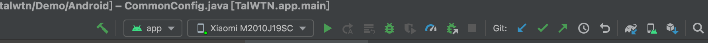
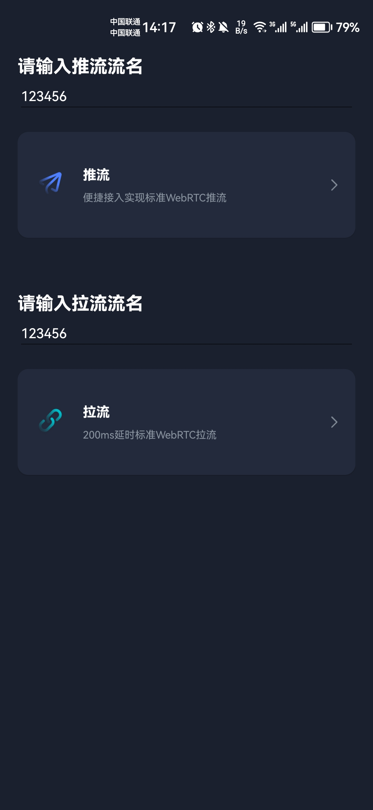

此项目中提供了 Android 平台的音视频通话 Demo。

基于该项目你可以体验 WTN 的音视频效果，通过阅读源码了解使用 WTN 的最佳实践。

## 前提条件

- Android Studio 3.0+。
- Android 5.0+ 的真机设备。

## 跑通Demo

### 步骤一 同步项目

1. 使用Android Studio 打开该工程.  Sync Project 下载所需的第三方库. 如: `jwt`

2. 配置工程

配置文件路径是：`app/src/main/java/com/eaydu/talwtn/demo/utils//CommonConfig.java`

> 打开该路径. 选择 您项目的 `AppID`和 `AppKey` 项目默认的值, 会有时长等限制, 可做简单的体验.

### 步骤二 编译运行

1. 连接 Android 真机。连接成功后，设备名称出现在界面上方，如下图所示。

2. 运行工程文件。工程运行后，将会在已连接的 Android 真机上安装 WTN 应用，并启动。

> 需要注意的是，您的 Android 设备或许会拦截安装过程。如果有相关的弹窗，请选择继续安装。

## 使用App

### 发布功能测试

按以下步骤进行发布功能测试：

在 Android 终端上，打开 App，进入首页。输入推流流名, 默认`123456`.

点击`推流`, 即可体检

### 订阅功能测试
在 Android 终端上，打开 App，进入首页。输入拉流流名, 默认`123456`.

点击`拉流`, 即可体检

