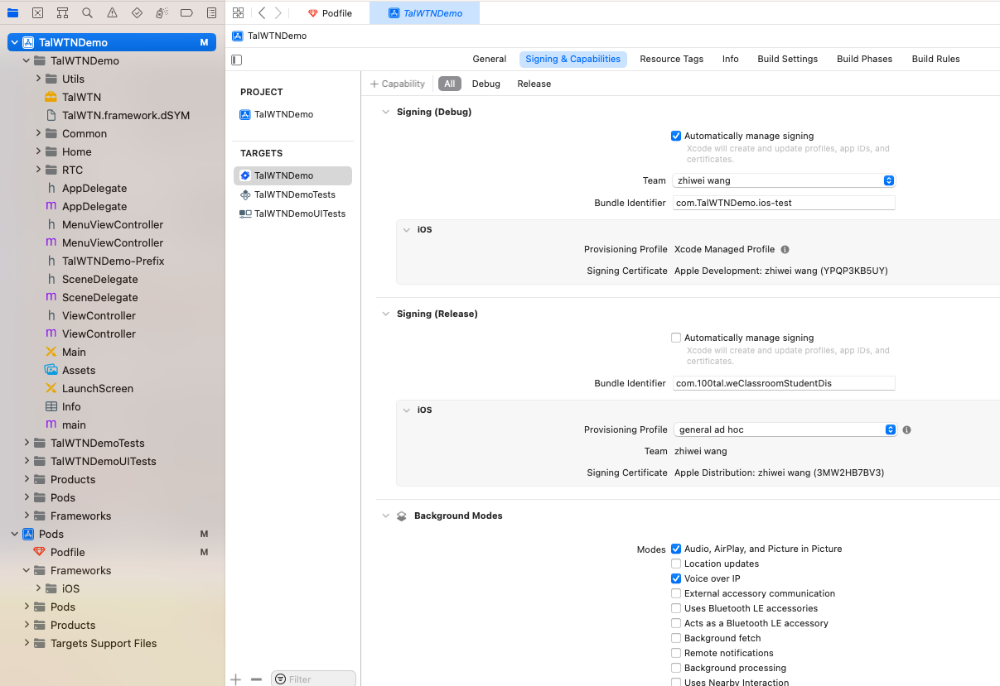
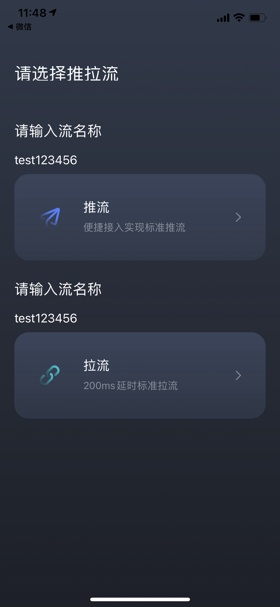

此项目中提供了 iOS 平台的音视频通话 Demo。

基于该项目你可以体验 WTN 的音视频效果，通过阅读源码了解使用 WTN 的最佳实践。

## 前提条件

- Xcode 11.0+。
- iOS 11.0+ 的真机设备。

## 跑通Demo

### 步骤一 同步项目

1. 使用Xcode 打开该工程.  Pod 下载所需的第三方库. 如: `jwt`

2. 配置工程

配置文件路径是：`TalWTNDemo/TalWTNDemo/TalWTNDemo-Prefix.pch`

> 打开该路径. 选择 您项目的 `AppID`和 `AppKey` 项目默认的值, 会有时长等限制, 可做简单的体验.

### 步骤二 编译运行

1. 连接真机。并配置您自己的 Bundle Identifier 以及描述文件。

2. 编译运行。工程运行后，将会在已连接的 真机上安装 WTN 应用，并启动。

## 使用App

### 发布功能测试

按以下步骤进行发布功能测试：

1. 在手机上，打开 App，进入首页。选择发布。
根据提示，允许应用获取相应的权限

点击`推流`, 即可体检

### 订阅功能测试
在 iOS 终端上，打开 App，进入首页。输入拉流流名.

点击`拉流`, 即可体检

