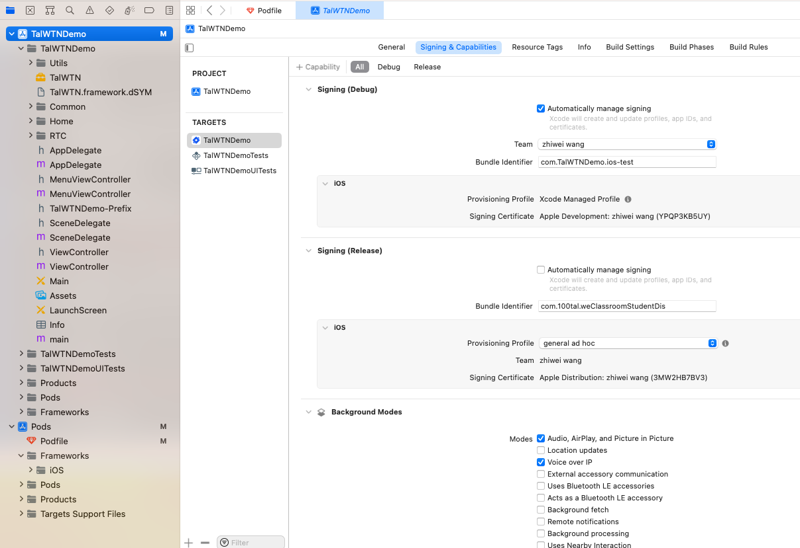

This project provides a demo of audio and video calls for the iOS platform.

With this project, you can experience the audio and video effects of WTN and learn about the best practices for using WTN by reading the source code.

## Prerequisites

- Xcode 11.0+。
- iOS 11.0+ 的真机设备。

## Running the Demo

### Step 1: Sync the Project

1. Open the project in Xcode. Sync the project to download the required third-party libraries, such as `jwt`.

2. Configure the project.

The configuration file is located at `TalWTNDemo/TalWTNDemo/TalWTNDemo-Prefix.pch`.

> Open this file and select the `AppID` and `AppKey` for your project. The default values have time and other limitations, but they are suitable for simple testing.

### Step 2: Build and Run

1. Connect your iOS device to your computer. Configure your own Bundle Identifier and description file.

2. Run the project. The project will install the WTN app on your connected iOS device and launch it.

## Using the App

### Testing the Publishing Function

To test the publishing function, follow these steps:

1. Open the app on your iOS device and go to the home page.

2. Enter a stream name for publishing.

3. Click "Publish" to start the test.

### Testing the Subscription Function

To test the subscription function, follow these steps:

1. Open the app on your iOS device and go to the home page.

2. Enter a stream name for subscription.

3. Click "Subscribe" to start the test.
