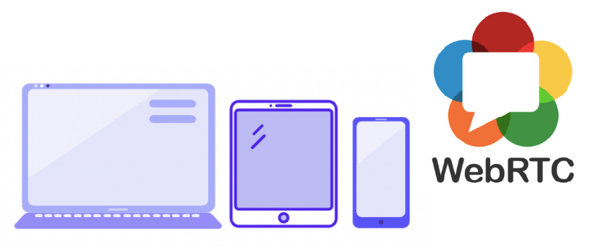
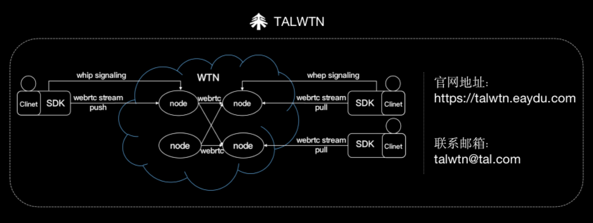

# TALWTN产品简介

 WTN即 WebRTC Transmission Network，是一个 IETF规范草案，在WebRTC基础上增加了一个标准化的信令层，能够将WebRTC发布者连接到流媒体服务器。

WebRTC作为W3C正式推荐标准及IETF标准的媒体协议，能够用于实现丰富、交互、实时的音视频通信，在媒体开发者中非常受欢迎，但一直以来缺少标准化的信令，WTN则能够补齐这部分短板。

上行使用WHIP信令协议，即WebRTC-HTTP Ingestion Protocol的缩写，基于HTTP支持WebRTC的内容摄取到流媒体；下行使用WHEP信令协议，即WebRTC-HTTP Egress Protocol的缩写，能够基于HTTP支持WebRTC的观众观看来自流媒体服务的内容。

WHIP和WHEP通过HTTP POST交换SDP Offer/Answer实现音视频能力的协商，协助WebRTC实现上行媒体采集、编码封装、传输到服务器、下行发送音视频数据、解码和播放，最终在客户端渲染呈现的音视频传输处理全流程。

对于实时互动服务来说，除了提供高质量、强稳定的基本服务，更要为对接的开发者考虑，尽量提供**通用化、标准化**的服务。好未来秉持为开发者最大限度降低开发成本、快速对接的理念，也基于WTN推出了媒体和信令标准化的音视频能力，即**TALWTN（WebRTC Transmission Network）**，能够支持包括android、ios、web、windows、mac等主流终端的跨平台互通。

WTN实现推拉流能力的对接方式简单，主要通过以下4个核心接口：

- 创建推流资源接口
调用此接口，向 WTN 服务端发送 SDP Offer。如果调用成功，WTN 服务端会创建发布资源，发布客户端会收到来自 WTN 服务端的 SDP Answer。

- 销毁推流资源接口
调用此接口，销毁指定的发布资源。
如果调用成功，指定的发布资源和相同 StreamID 的订阅资源都会被销毁，并且，已经通过 PeerConnection 与此订阅资源建立的连接会断开。

- 创建拉流资源接口
调用此接口，向 WTN 服务端发送 SDP Offer。如果调用成功，WTN 服务端会创建订阅资源，订阅客户端会收到来自 WTN 服务端的 SDP Answer。

- 销毁拉流资源接口
调用此接口，销毁指定的订阅资源。销毁订阅资源对对应的发布资源没有影响。如果调用成功，已通过 PeerConnection 与此订阅资源建立的连接会断开。 

 通过TALWTN实现实时互动，对质量有高要求的应用产品开发者来说，无需对接多厂商也能实现容灾互备；整套标准媒体信令接入接口简单，能够简单高效的实现实时音视频功能；与此同时，能够保障全球覆盖高可用，享受低成本、低延迟、高品质的实时音视频互动体验！

