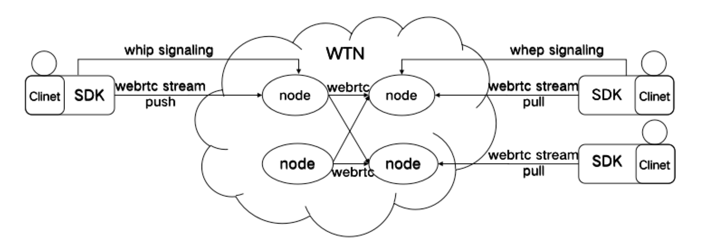
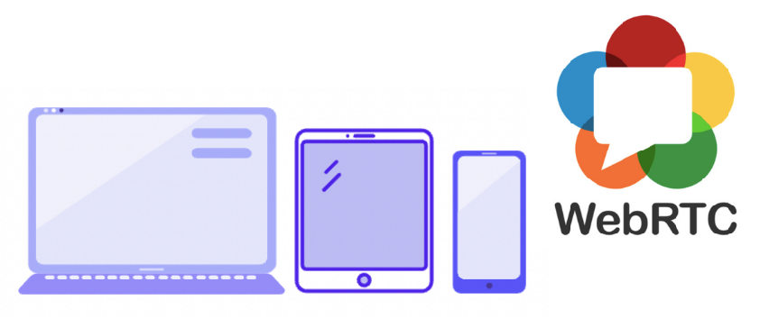

# TALWTN Product Introduction

WTN (WebRTC Transmission Network) is an IETF draft specification that adds a standardized signaling layer to WebRTC to connect WebRTC publishers to streaming media servers.

WebRTC, as a media protocol officially recommended by W3C and IETF standards, can be used to implement rich, interactive, real-time audio and video communication. It is very popular among media developers. However, it has always lacked standardized signaling. WTN can fill this gap.

WHIP signaling protocol is used for upstream transmission, which stands for WebRTC-HTTP Ingestion Protocol. It supports WebRTC content ingestion into streaming media via HTTP. WHEP signaling protocol is used for downstream transmission, which stands for WebRTC-HTTP Egress Protocol. It supports audiences watching content from streaming media services via HTTP.

WHIP and WHEP exchange SDP Offer/Answer through HTTP POST to achieve audio and video capability negotiation. They assist WebRTC in upstream media collection, encoding packaging, transmission to the server, downstream sending of audio and video data, decoding and playback, and finally rendering audio and video transmission processing in the client.

For real-time interactive services, in addition to providing high-quality and strong stable basic services, it is more important to consider developers who are docking with them and provide universal and standardized services as much as possible. Based on the concept of minimizing development costs and rapid docking for developers, TALWTN (WebRTC Transmission Network) was launched based on WTN’s media and signaling standardization capabilities. It can support cross-platform interoperability of mainstream terminals such as android, ios, web, windows, mac.

The docking method of WTN’s push-pull stream capability is simple and mainly through the following four core interfaces:

Create push stream resource interface Call this interface to send SDP Offer to the WTN server. If the call is successful, the WTN server will create a publishing resource and the publishing client will receive an SDP Answer from the WTN server.

Destroy push stream resource interface Call this interface to destroy the specified publishing resource. If the call is successful, the specified publishing resource and subscription resources with the same StreamID will be destroyed. The connection established with this subscription resource through PeerConnection will also be disconnected.

Create pull stream resource interface Call this interface to send SDP Offer to the WTN server. If the call is successful, the WTN server will create a subscription resource and the subscription client will receive an SDP Answer from the WTN server.

Destroy pull stream resource interface Call this interface to destroy the specified subscription resource. Destroying a subscription resource has no effect on its corresponding publishing resource. If the call is successful, the connection established with this subscription resource through PeerConnection will be disconnected.

Through TALWTN implementation of real-time interaction, for application product developers who have high requirements for quality, they can achieve disaster recovery without docking multiple vendors; The entire set of standard media signaling access interfaces are simple and efficient for implementing real-time audio and video functions; At the same time, it can ensure global coverage with high availability and enjoy low-cost, low-latency and high-quality real-time audio and video interactive experience!

