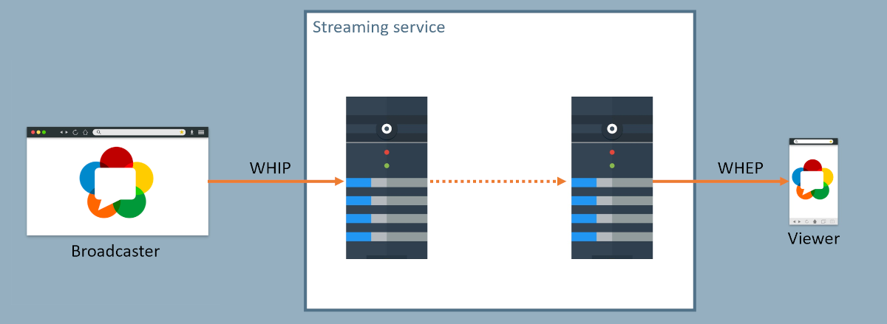
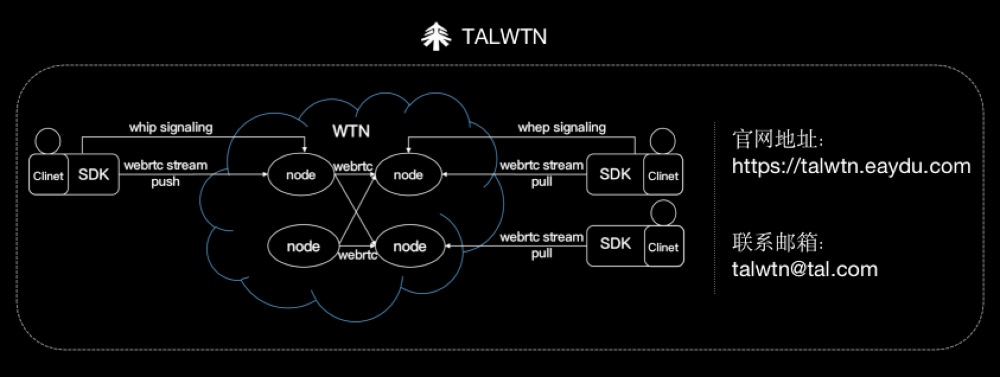

# WTN普及（一）WHIP/WHEP标准信令

## WebRTC标准化的“短板”

当今的互联网应用程序中，音视频通信已经成为了必不可少的一部分。为了实现高效、稳定的音视频通信，开发者需要使用一些专门的协议和技术。其中，WebRTC 技术是一种非常流行的技术，它可以帮助开发者构建高效、稳定的音视频通信应用程序。

然而对于流媒体行业的开发者来说，WebRTC并不是“完整的”，缺少了与之匹配的标准信令协议，而WHIP和WHEP的推出，补全了webrtc标准化的最后“短板”，在 WebRTC 之上增加了一个简单的信令层，将 WebRTC 发布者连接到WebRTC 媒体服务器，以解决市场需求痛点。

## 什么是WHIP/WHEP？

WHIP（WebRTC-HTTP Ingestion Protocol）和 WHEP （WebRTC-HTTP Egress Protocol），为 WebRTC 定义了信令协议，使用HTTP请求和响应来传输信令数据，用于实现音视频流的传输和处理。

WHIP协议应用于建立媒体“上行”传输之前，使用HTTP协议实现音视频能力的协商（利用HTTP POST交换SDP Offer/Answer），成功后由webRTC通过媒体捕获设备进行采集，然后通过WebRTC API进行编码和封装，最后将媒体流传输到服务器；

WHEP 协议应用于建立媒体“下行”传输之前，同样使用HTTP协议实现音视频能力的协商（利用HTTP POST交换SDP Offer/Answer），成功后由流媒体服务器主动发送音视频数据流，然后通过 WebRTC API 进行解码和播放，最终在客户端进行展示。

## WHIP/WHEP的优势

作为WebRTC的标准化信令协议，具备以下优点：

1. 简单易用：WHIP 和 WHEP 基于 HTTP 协议进行传输，这意味着开发者可以通过常规的接口请求进行控制，而不需要搭建私有的信令控制流程，因此它们非常易于使用和集成。

2. 高效可靠：都使用 WebRTC 技术来进行音视频编解码和传输，这意味着它们具有高效和可靠的性能，开发者可以使用标准信令协议来实现实时音视频通信功能，而不需要担心延迟和丢包等问题。

3. 跨平台支持：可以在多个平台上使用，包括桌面应用程序、移动应用程序和 Web 应用程序等，这意味着开发者可以实现跨平台的音视频通信，而不需要为每个平台单独开发。

4. 安全可靠：WHIP 和 WHEP 协议都支持加密传输，这意味着它们可以保证音视频数据的安全性和可靠性，开发者可以使用这些协议来实现安全的音视频通信，而不需要担心数据泄露和攻击等问题。
    
总之，WHIP 和 WHEP 协议是一种非常有前途的音视频通信协议，它们可以让开发者更加轻松地实现音视频通信功能。如果您正在开发音视频通信应用程序，那么 WHIP 和 WHEP 协议绝对值得一试。

## 好未来WTN产品

[TALWTN产品简介](./introduction.md)

